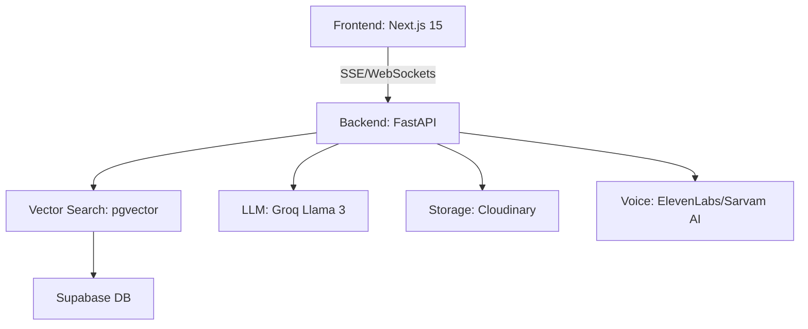

# 🧠 PersonaBot – Modern AI Persona Platform

PersonaBot is a high-performance, real-time AI platform designed for alumni, professors, and professionals to create personalized AI clones. These "Personas" represent their unique knowledge, experience, and conversational style, enabling students and mentees to learn from the best—anytime, anywhere.

---

## ✨ Core Features (Phase I)

- **Custom AI Personas**: Build unique AI personalities that "know" your specific documents and voice.
- **Advanced RAG Pipeline**: Utilizing **Nomic V2 (768d)** embeddings and **Supabase (pgvector)** for high-precision knowledge retrieval.
- **Automated Ingestion**: Support for PDFs, Web Scraping, and Docs with high-accuracy OCR (`EasyOCR` + `PyMuPDF`).
- **Real-time Streaming**: **Server-Sent Events (SSE)** for lightning-fast, token-by-token chat responses.
- **Conversation Context**: Persistent **Top-5 Message Rolling Window** to maintain continuity and "memory" in chats.
- **Multi-Tenant Security**: Robust data isolation using Supabase **Row Level Security (RLS)**.

---

## 🏗️ Technical Architecture



- **Frontend**: Next.js 15, Tailwind CSS 4, GSAP Animations.
- **Backend**: FastAPI, LangChain, Pydantic, AnyIO.
- **Database**: PostgreSQL (Supabase) with `pgvector` for similarity search.

---

## 🚀 Detailed Setup Guide

### 1. Prerequisites
- **Python**: 3.11 or higher
- **Node.js**: 18.x or higher
- **Docker**: (Optional, for containerized deployment)
- **Accounts**: Supabase, Groq, Cloudinary.

### 2. Backend Installation
1. **Navigate to backend**:
   ```bash
   cd backend
   ```
2. **Create virtual environment**:
   ```bash
   python -m venv venv
   source venv/bin/activate  # On Windows: .\venv\Scripts\activate
   ```
3. **Install dependencies**:
   ```bash
   pip install -r requirements.txt
   ```
4. **Environment Setup**:
   Copy `.env.example` to `.env` and fill in the following:
   - `SUPABASE_URL` & `SUPABASE_KEY`: From your Supabase Project Settings.
   - `GROQ_API_KEY`: From Groq Cloud console.
   - `CLOUDINARY_*`: From your Cloudinary Dashboard.
   - `EMBEDDING_MODEL`: Set to `nomic-ai/nomic-embed-text-v2-moe`.

### 3. Database Migration
Enable `pgvector` in your Supabase instance and run the SQL scripts in order:
- **Schema**: [database/sql/supabase_schema.sql](file:///c:/Mern%20Stack/persona_ai_capstone/backend/database/sql/supabase_schema.sql)
- **Security (RLS)**: [database/sql/rls.sql](file:///c:/Mern%20Stack/persona_ai_capstone/backend/database/sql/rls.sql)

### 4. Frontend Installation
1. **Navigate to frontend**:
   ```bash
   cd frontend
   ```
2. **Install packages**:
   ```bash
   npm install
   ```
3. **Configure Environment**:
   Create `.env.local` with:
   ```env
   NEXT_PUBLIC_SUPABASE_URL=your_supabase_url
   NEXT_PUBLIC_SUPABASE_ANON_KEY=your_supabase_anon_key
   NEXT_PUBLIC_API_URL=http://localhost:8000/api
   ```

---

## 🏎️ Running the Project

**Start Backend**:
```bash
# Inside /backend
uvicorn main:app --reload
```

**Start Frontend**:
```bash
# Inside /frontend
npm run dev
```

---

## 🔮 Future Roadmap (Phase II)

- **Live Talk Mode**: Real-time voice interaction using **WebSockets** and **Deepgram**.
- **RAG Reranking**: Two-stage retrieval (Retrieve 15 -> Rerank top 5) for extreme accuracy.
- **Monetization**: **Cashfree** integration for "Free vs Paid" persona access.
- **Indic Language Support**: Hindi/Regional TTS via **Sarvam AI**.

---

## 📄 Documentation
- [Detailed Technical Docs](file:///c:/Mern%20Stack/persona_ai_capstone/Docs.md)
- [System Workflow](file:///c:/Mern%20Stack/persona_ai_capstone/WorkFlow.md)

## ⚖️ License
MIT
