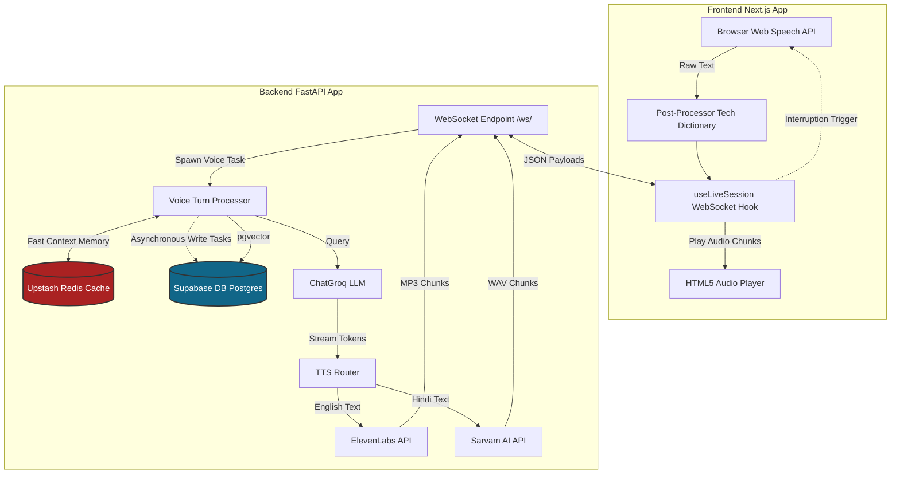

# Ask Mentor Live Interaction: Architecture & Notes

## Concise Notes on Live Mode Operations

The Live Mode interaction provides a full-duplex, low-latency conversational experience with the AI Mentor. It operates via a robust WebSocket connection and coordinates Speech-To-Text (STT), Large Language Models (LLM) with RAG, and Text-To-Speech (TTS) streaming. 

*(Note: Unlike the CivicPulse project, Ask Mentor does not use any `<DRAFT_READY />` tag parsing logic. The LLM output is streamed directly to the TTS engine.)*

### 1. Frontend Audio Capture & Transmission
- **Web Speech API (STT):** The frontend (`useAudioCapture.ts`) utilizes the browser's native `SpeechRecognition` API for real-time continuous speech-to-text.
- **Post-Processing:** A developer-domain post-processor corrects common browser STT mishearings (e.g., "super bass" to "Supabase").
- **WebSocket Transport:** Validated text transcripts are sent as `user_text` JSON payloads over a WebSocket (`useLiveSession.ts`) to the backend.
- **Echo Cancellation:** The frontend automatically mutes the user's microphone when the AI is actively speaking and resumes listening afterward to prevent audio loops.

### 2. Backend Orchestration (FastAPI)
- **Session Management:** The REST endpoint (`/session/start`) validates the user, checks credit/access limits, and spins up a Redis session. The WebSocket router (`/ws/{session_id}`) then connects to this session.
- **Language Detection:** The backend automatically detects if the user spoke in English or Hindi and toggles the session language on the fly.
- **Concurrent RAG Processing:** Incoming text triggers `process_voice_turn` as a background task. It pulls relevant context using `pgvector` and streams the LLM response via Langchain (Groq).
- **Interruption Handling:** If the user speaks again while the AI is processing/speaking, an `interrupt` signal cancels the active LLM background task and signals the TTS loop to abort.

### 3. Text-To-Speech (TTS) Streaming
- **Dynamic TTS Routing:** The system routes English text to **ElevenLabs** (mp3) and Hindi text to **Sarvam AI** (wav).
- **Direct Streaming:** The LLM token stream is yielded directly to the TTS engine asynchronously.
- **Base64 Audio Chunks:** Audio is generated in chunks and streamed as base64-encoded strings back to the frontend.

### 4. Frontend Audio Playback
- **Chunk Accumulation & Playback:** The frontend accumulates the base64 audio chunks, converts them to a `Uint8Array`, wraps them in a `Blob`, and plays them smoothly using the HTML5 `Audio` element.
- **TTS Fallback:** If the backend TTS stream fails, the frontend falls back to the browser's native `SpeechSynthesis` API to guarantee delivery.

---

## 5. Shared Context Memory Pipeline 

To achieve human-like conversation continuity without degrading latency, the system utilizes a **Hybrid Asynchronous Context Memory** design.

```
                  +-----------------------------------------+
                  |         Incoming Voice Turn             |
                  +-----------------------------------------+
                                       |
                                       v
                     /-----------------------------------\
                    /  Is Bot Config & Chat History in    \
                   <   Upstash Redis Cache (Key: chat_...)? >
                    \                                    /
                     \-----------------------------------/
                               /               \
                       YES    /                 \   NO (Cache Miss)
                             v                   v
                 +-----------------------+   +-----------------------+
                 |  Instant Redis Read   |   | Query Supabase (SQL)  |
                 |      (< 1ms)          |   |  - bot table          |
                 |                       |   |  - message table      |
                 +-----------------------+   +-----------------------+
                             \                   /
                              \                 /  Optimistically Cache
                               v               v
                +---------------------------------------------+
                | Combined LLM Context Prompt Construction    |
                | - Bot System Persona / Configuration        |
                | - Last 5 Messages (Chat History Context)    |
                | - Top 5 Vector Search Results (pgvector)     |
                +---------------------------------------------+
                                       |
                                       +================================+
                                       |                                |
                                       v (Foreground Task)              v (Background Task)
                          +-------------------------+      +-------------------------+
                          |   Launch Groq LLM &     |      |  asyncio.create_task()  |
                          |   TTS Audio Stream      |      |  Save User & AI message |
                          |   (Immediate playback)  |      |   to Supabase Postgres  |
                          +-------------------------+      +-------------------------+
```

### Key Latency-Saving Elements:
1. **Upstash Redis Caching:**
   - Both **Bot Config** (`bot_config:{bot_id}`) and **Last 5 Messages** (`chat_history:{bot_id}:{user_id}`) are read directly from Redis in $<1\text{ms}$.
   - Only on a rare cache miss does the system fall back to Supabase Postgres (taking 100-200ms) and then immediately warms up the Redis cache.
2. **Background Database Writes:**
   - Saving the user's transcript and the assistant's response to the persistent `messages` table in Supabase is executed using `asyncio.create_task()`.
   - This fires a non-blocking, background thread task to persist the data to the SQL DB, returning control to the voice loop in $0\text{ms}$.
3. **Interruption Harvesting:**
   - If the user interrupts, the foreground loop is aborted via `asyncio.CancelledError`.
   - The system intercepts the cancellation, retrieves the *partial text* generated up to that exact millisecond, appends `... [interrupted]`, and pushes it to Redis and Supabase in the background.

---

## Architecture Diagram

```mermaid
sequenceDiagram
    autonumber
    participant User
    participant Frontend as Next.js Frontend
    participant WS as FastAPI WebSocket
    participant Cache as Upstash Redis Cache
    participant RAG as RAG Pipeline (pgvector)
    participant LLM as ChatGroq LLM
    participant DB as Supabase Database

    User->>Frontend: Speaks (Voice Turn)
    Frontend->>Frontend: Web Speech API (STT) & Tech Post-Processing
    Frontend->>WS: Send {"type": "user_text", "text": "..."}
    
    rect rgb(24, 30, 45)
        Note over WS,Cache: Context Retrieval (Shared with standard text chat)
        WS->>Cache: get_cache(chat_history:{bot_id}:{user_id})
        alt Cache Hit (< 1ms)
            Cache-->>WS: Return Last 5 Messages
        else Cache Miss
            WS->>DB: Query get_recent_messages (SQL)
            DB-->>WS: Return Messages
            WS->>Cache: set_cache(chat_history)
        end
    end

    rect rgb(28, 48, 38)
        Note over WS,DB: Asynchronous User Message Persistence
        WS->>Cache: Append current user message & update cache
        WS->>DB: asyncio.create_task(save_message("user"))
    end

    rect rgb(24, 30, 45)
        Note over WS,LLM: Foreground Voice Generation Loop
        WS->>RAG: retrieve_similar_chunks (pgvector)
        RAG-->>WS: Return Top 5 Context Chunks
        WS->>LLM: ChatGroq.astream(SystemPrompt + History + UserText)
        
        loop Token-by-Token TTS Streaming
            LLM-->>WS: Stream LLM Tokens
            WS->>Frontend: Stream base64 audio chunks (wav/mp3)
        end
    end

    alt Normal Completion
        WS->>Frontend: Send {"type": "speaking_done"}
        WS->>Cache: Append full AI response to chat_history cache
        WS->>DB: asyncio.create_task(save_message("assistant"))
        WS->>Cache: Invalidate full_history cache
    else User Interrupted
        User->>Frontend: Speaks (Interrupts AI)
        Frontend->>WS: Send {"type": "interrupt"}
        WS->>WS: Catch CancelledError & harvest partial generated text
        WS->>Cache: Append partial text ("... [interrupted]") to cache
        WS->>DB: asyncio.create_task(save_message("assistant_partial"))
        WS->>Cache: Invalidate full_history cache
    end
```



## System Component Diagram


